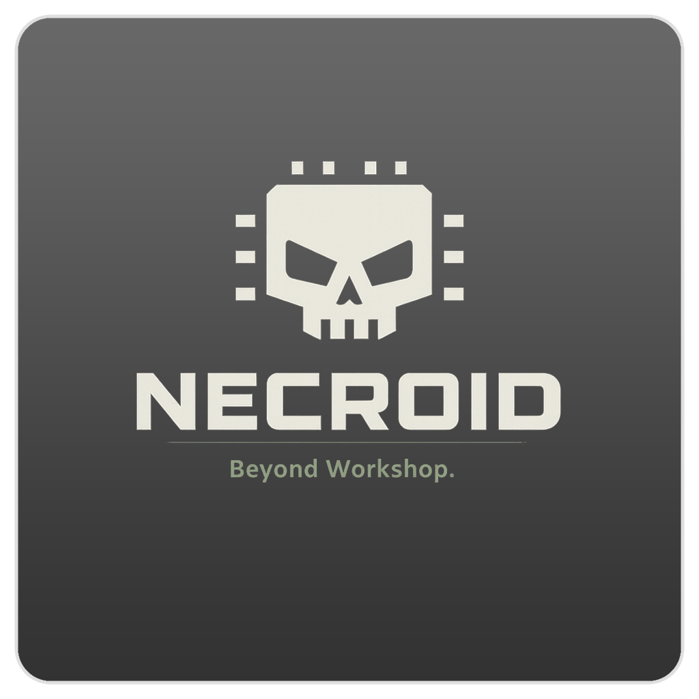
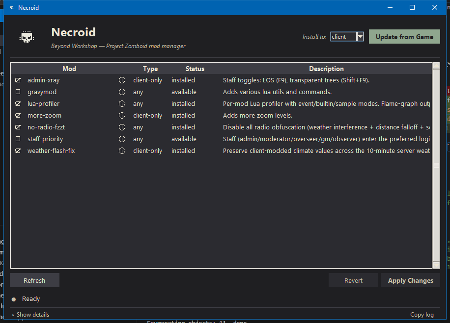

<p align="center">
  
</p>

<h1 align="center">Necroid</h1>

<p align="center"><em>Beyond Workshop.</em></p>

<p align="center">
  Java Mods for <strong>Project Zomboid</strong> that reach parts Steam Workshop can't.
</p>

---

## What is this?

You know how Steam Workshop is great, until you want change how radios work, have an admin X-ray that actually works, or a write a new mod that rewrites how the map loads? Workshop mods can only touch lua scripts and assets. They can't touch the Java engine underneath. Necroid can.

Necroid ships a bundle of Java-level mods for Project Zomboid plus a small app to install and uninstall them cleanly. Everything is reversible — you can always put the game back exactly how Steam shipped it.

<p align="center">
  
</p>

---

## Why is this different?

Necroid is a diff-based mod manager. It works by making a pristine copy of the vanilla Java classes, then applying mods as patches on top. To uninstall, it just deletes the patched classes and copies the pristine ones back in. No file-level patching, no bytecode rewriting, no classloader shenanigans.

Necroid does not ship any Project Zomboid files, bytecode, or decompiled sources. This ensures Necroid is legally safe and provides a very easy way to update these mods for small version changes in PZ. When PZ updates, just refresh the pristine baseline and re-apply the patches. If the update is small, the patches will mostly apply cleanly with a few manual tweaks. If the update is large, the patches won't apply at all, but you can still use them as a reference for what changed and how to fix it.. then make a PR with the fixes :-)

Finally, it's safer. No random .class files downloaded from the internet that you just have to trust. All mods in necroid are source-code, reviewable, and built locally on your machine.

## Install

1. Install these one-time prerequisites:

   | Tool | Windows (`winget`) | macOS (`brew`) | Linux |
   |---|---|---|---|
   | Git | `winget install --id Git.Git -e` | `brew install git` | `apt install git` |
   | JDK 17+ | `winget install EclipseAdoptium.Temurin.17.JDK` | `brew install --cask temurin@17` | `apt install openjdk-17-jdk` |

2. Download the latest release for your OS from <https://github.com/mrkmg/necroid/releases> and unzip anywhere you like.
3. Double-click **necroid** (or `necroid.exe` on Windows). The Necroid window opens.

   > **Windows:** if Project Zomboid is installed under `C:\Program Files (x86)\`, right-click **necroid.exe** → **Run as administrator**. That path is read-only otherwise, and Necroid needs to write new class files there.

## Using Necroid

On first launch, click **Set Up** in the top-right. Necroid finds your Steam install, makes a pristine copy of the vanilla Java classes, downloads the decompiler, and sets up the mod workspace. Takes about a minute. You only do this once (and again after a Project Zomboid update — the same button becomes **Update from Game**).

The mod list is **state-based**: the checkboxes automatically reflect what's currently installed on the chosen destination (client or server). Just tick what you want installed and untick what you don't:

- Check / uncheck mods to match your desired set.
- Click **Apply Changes**. Necroid works out the diff and installs anything added / uninstalls anything removed in a single atomic step.
- Launch Project Zomboid as usual.

The Status column previews the diff before you apply: `installed`, `pending add`, `pending remove`, `available`. **Revert** discards pending edits and snaps the checkboxes back to what's actually installed. Switching the **Install to** toggle (client ↔ server) re-reads state for that destination — client and server have independent stacks.

To roll back everything, uncheck every box and click **Apply Changes** — the game goes back to exactly how Steam shipped it.

If something drifted (e.g. Steam ran a "Verify Integrity of Game Files" pass and reverted everything), the checkboxes will still show what Necroid thinks is installed. Click **Apply Changes** once to re-install, or uncheck and re-check a mod to force a reapply.

## Bundled mods

Each mod ships with its own README — click through for behaviour notes, in-game commands, and compatibility caveats.

| Mod | Client-only? | What it does |
|---|---|---|
| [admin-xray](mods/admin-xray-41/README.md) | yes | Staff render overrides — **F9** for LOS / wall-cutaway, **Shift+F9** fades every static world object. |
| [gravymod](mods/gravymod-41/README.md) | no | Adds various lua utils and commands. |
| [lua-profiler](mods/lua-profiler-41/README.md) | no | Per-mod Lua profiler with event/builtin/sample modes. Flame-graph output + mod/file filter. |
| [more-zoom](mods/more-zoom-41/README.md) | yes | Adds one extra zoom-out (300%) and one extra zoom-in (25%) level. |
| [multi-login](mods/multi-login-41/README.md) | no | Server-side: login queue admits N players concurrently instead of one at a time. Adds `MaxConcurrentLogins` (1–32, default 3). Depends on staff-priority. |
| [no-radio-fzzt](mods/no-radio-fzzt-41/README.md) | no | Disable all radio obfuscation (weather interference + distance falloff + scramble pipeline). Install to client or server. |
| [notifications](mods/notifications-41/README.md) | yes | Utility / API mod. Shared toast-notification surface other mods call into. |
| [slow-chunk-fix](mods/slow-chunk-fix-41/README.md) | yes | Raise the connecting-client chunk-download stall timeout from 60s to 10min so slow links finish loading instead of giving up. |
| [staff-priority](mods/staff-priority-41/README.md) | no | Staff (admin / moderator / overseer / gm / observer) skip ahead of VIPs and regular players in the login queue when the server is full. |
| [weather-flash-fix](mods/weather-flash-fix-41/README.md) | yes | Stops the 10-minute weather-resync flash when a Lua mod (e.g. Wasteland) is overriding client climate values. |

"Client-only" mods require a Project Zomboid **client** install and can only be installed to the client. Non-client-only mods can install to either the client or the Dedicated Server.

Some mods declare **dependencies** on other mods (e.g. `multi-login` depends on `staff-priority`). Necroid pulls the full dependency closure into the install stack automatically — you don't need to tick the dep yourself, and the GUI will offer to tick / untick dependents when you toggle a dep.

In the Necroid GUI, click the **ⓘ** next to any mod to read its README without leaving the app.

## Importing mods from GitHub or GitLab

Necroid pulls mods from a GitHub or GitLab repo following the canonical layout: `<repo-root>/mods/<name>-<major>/mod.json`. That's the only supported shape — it's what `necroid init` scaffolds in every author's repo, so every published Necroid mod looks the same.

GitHub is the default — a bare `owner/repo` slug always means GitHub. GitLab is opted in via a full URL (including self-hosted instances), since GitLab's nested-group paths make bare slugs ambiguous.

- **GUI**: click **Import…** in the header. Enter `owner/repo`, a github.com URL, or a full GitLab URL, plus an optional branch / tag. Necroid discovers the available mods and shows them in a checklist — pick one or many, then **Import**. Mods that don't match your workspace's PZ major are flagged red and disabled.
- **CLI**:
  ```bash
  necroid import owner/repo --list                       # GitHub — discover mods in the repo
  necroid import owner/repo --all                        # import every mod matching your workspace major
  necroid import owner/repo --mod admin-xray             # import a specific mod (repeatable)
  necroid import owner/repo --ref v1.2.0                 # pin to a tag or branch
  necroid import owner/repo --force                      # overwrite existing mods of the same name
  necroid import https://gitlab.com/ns/proj --all        # GitLab — full URL required
  necroid import https://gitlab.example.com/g/sub/p --all   # self-hosted GitLab works too
  ```

Imported mods land at `mods/<base>-<workspaceMajor>/` — the same layout as locally-authored mods. Each imported mod's `mod.json` records an `origin` block (provider type, host for GitLab, repo, ref, subdir, commit SHA) so it can be refreshed later.

### Updating imported mods

- **GUI**: click **Check Updates** in the header. Necroid queries each imported mod's source repo (GitHub or GitLab, as recorded in its `origin` block) and decorates the Version column with a `⬆ <new>` badge when an update is available. The status strip shows a clickable `N updates available` chip — click it to update them all in one go. Right-click any imported row for **Update now**, **Update with peers from same repo**, **Reimport (force)**, **Show origin**, or **Open origin in browser**.
- **CLI**:
  ```bash
  necroid mod-update                    # check + apply updates for every imported mod
  necroid mod-update --check            # dry-run: report what would change
  necroid mod-update admin-xray         # one mod by name
  necroid mod-update admin-xray --include-peers   # also any mods sharing the same repo+ref
  necroid mod-update --force            # apply even if upstream version is older or equal
  ```

Updates are atomic per-mod: `mod.json` and `patches/` are replaced wholesale, but local-only fields (`pristineSnapshot`, `expectedVersion`, `createdAt`) are preserved. A mod that's currently `enter`-ed is skipped to avoid clobbering your in-progress edits — `necroid clean <mod>` first if you really mean it.

When several mods come from the same repo + ref, `mod-update` fetches the archive once and refreshes all of them together.

## Updates

Necroid has **two** independent update channels:

1. **The Necroid binary itself** — checked once a day in the background, applied via `necroid update`.
2. **Mods** — both the bundled ones (admin-xray, gravymod, etc.) and any you imported from third-party repos. Refreshed via `necroid mod-update` or the GUI's **Check Updates** button.

These are decoupled on purpose: you don't have to download a fresh binary just because admin-xray got a small fix.

### Updating the binary

- **GUI**: a yellow banner appears below the header when an update is available — click **Install Update** and Necroid downloads the new binary, swaps it in place, and closes. Re-open it to start using the new version. Click **Dismiss** to ignore the banner for the current session.
- **CLI**: a one-line `update available: vX.Y.Z → vA.B.C (run: necroid update)` notice prints after any command (silenced when stderr is redirected — scripts stay clean). Run `necroid update` to apply, `necroid update --check` to just check, or `necroid update --rollback` to swap back to the previous binary if something went wrong. Set `NECROID_NO_UPDATE_CHECK=1` to disable background checks entirely.

Self-update only works for the packaged binary you downloaded from the [Releases page](https://github.com/mrkmg/necroid/releases). If you installed from source (`pip install -e .`), use `git pull` instead. On Windows, if Necroid lives under `C:\Program Files`, the update needs an elevated shell — run as administrator. Your installed mods, your Project Zomboid install, and `data/.mod-config.json` are never touched by the updater; only the `necroid` binary itself is replaced.

### Updating mods (bundled + imported)

Bundled mods ship with their `mod.json` already wired to point back at `mrkmg/necroid` — Necroid treats them just like any third-party imported mod. So one command refreshes everything:

```bash
necroid mod-update              # check + apply updates for every mod
necroid mod-update --check      # dry-run; populates the GUI badges
```

In the GUI, **Check Updates** in the header does the same and decorates the Version column with `⬆ <new>` badges; the "N updates available" chip in the status strip is a one-click bulk update.

What this means in practice:

- **You don't have to redownload the binary** just to get newer admin-xray patches. `necroid mod-update` pulls them from `mrkmg/necroid`'s `main` branch. Same flow as a third-party mod.
- **The same goes for third-party mods.** A mod you imported from `someone/their-cool-mod` refreshes from that repo. Necroid groups updates by source repo, so several mods from the same upstream share one archive download.
- **Mods you're actively editing (`enter`-ed) are skipped.** No clobbering of your in-progress work.
- **Local-only fields are preserved** across updates — `pristineSnapshot`, `expectedVersion`, `createdAt`. Upstream wins on `description`, `version`, `clientOnly`, dependencies, and the `patches/` directory.

If you want to "freeze" a bundled mod and stop refreshing it from upstream — e.g. you've hand-edited it — delete the `origin` block from its `mods/<mod>/mod.json`. `mod-update` skips any mod without an origin.

### Publishing your own mods on GitHub or GitLab

A Necroid mod lives at `mods/<base>-<PZ-major>/` in your repo (e.g. `mods/admin-xray-41/`) with `mod.json` + `patches/` inside. Push the repo and anyone can pull it with `necroid import <your-repo>` (GitHub bare slug) or `necroid import https://gitlab.com/<ns>/<proj>` (GitLab URL). No registry, no manifest, no build step on the user's end.

> **The `-<major>` suffix is part of the mod's identity, not a local convention.** Necroid keeps the suffix verbatim through import and update, so per-PZ-major variants of the same mod can live side by side. If you support PZ 41 and PZ 42, ship both as `mods/<base>-41/` and `mods/<base>-42/` in the same repo on the same branch — no separate branches per game major.

#### Canonical repo layout

The only supported layout is the one `necroid init` scaffolds for you:

```
my-cool-mod/                    # your repo's root (any name)
├── README.md
├── .gitignore                  # written by `necroid init` — keeps workspace/state/tmp out
└── mods/
    ├── my-cool-mod-41/
    │   ├── mod.json            # "name": "my-cool-mod-41", expectedVersion: "41.78.19"
    │   └── patches/
    └── my-cool-mod-42/         # optional sibling for another PZ major
        ├── mod.json
        └── patches/
```

Every published Necroid mod looks exactly like this. A user on PZ 41 imports and gets `my-cool-mod-41`; a user on PZ 42 gets `my-cool-mod-42`. Same `git pull`, same `mod-update`. You can ship several unrelated mods in one repo too — just add more siblings under `mods/`. This is the exact same layout Necroid itself uses for its bundled mods.

#### Step-by-step

1. **Create your repo** and `cd` into it.
2. **Drop Necroid at the root.** Copy-paste from a release into the repo root.
3. **Run `necroid init`.** Seeds the shared workspace from your local PZ install, scaffolds `mods/`, and writes a default `.gitignore` covering every Necroid-generated path (`data/workspace/`, `data/tools/*`, `data/.mod-*.json`, `src-*/`, `dist/`, `build/`). If you already have a `.gitignore`, Necroid leaves it alone.
4. **Scaffold your mod:** `necroid new my-cool-mod -d "what it does"` → creates `mods/my-cool-mod-<workspaceMajor>/`. The `-<major>` suffix is added automatically from your bound workspace major.
5. **Develop:** `necroid enter my-cool-mod`, edit under `src-my-cool-mod/`, `necroid capture`, `necroid test`, `necroid install my-cool-mod --to client` — iterate until it builds and behaves in-game.
6. **Bump the version** in `mod.json` (`"0.1.0"` → `"0.1.1"`, etc). `mod-update` uses semver-style ordering on this field — monotonically-increasing values trigger refreshes for your users.
7. **Set `expectedVersion`** to the PZ version you authored against (e.g. `"41.78.19"`). The dir suffix's major (`-41`) is the hard gate; `expectedVersion` drives soft "you might want to recapture" warnings on minor / patch drift.
8. **Commit & push:**
   ```bash
   git add README.md mods/
   git commit -m "Initial release"
   git branch -M main
   git remote add origin https://github.com/<you>/my-cool-mod.git
   git push -u origin main
   ```
   Everything else is already gitignored by step 3's scaffolded `.gitignore`.
9. **(Optional) Tag a release** so users can pin to a specific version: `git tag v0.1.1 && git push --tags`. They run `necroid import <you>/my-cool-mod --ref v0.1.1`.
10. **Tell users:** `necroid import <you>/my-cool-mod`. From then on, `necroid mod-update` (or the GUI's **Check Updates** button) pulls every new version you publish.

#### What ships and what doesn't

`necroid import` copies everything except `.git*` and `.github/` from each mod's source dir into the user's `mods/<dirname>/` (GitLab repos have the same rule applied). The dirname comes from your upstream — `<base>-<major>` is preserved verbatim. So you can include a `README.md`, a `LICENSE`, screenshots, etc. — they all travel with the mod and the GUI shows the README when the user clicks the **ⓘ** glyph next to your mod.

`mod.json` is rewritten on import: the user's local `pristineSnapshot`, `expectedVersion`, and `createdAt` survive across re-imports; everything else (description, version, clientOnly, dependencies, incompatibleWith) is taken from your upstream copy. Your `version` field is what drives "an update is available". Necroid stamps an `origin` block into the imported `mod.json` so it remembers where to fetch from.

#### Supporting a new PZ major

When PZ moves from 41 → 42:

1. Don't touch your existing `my-cool-mod-41/`. It stays exactly as it is, and existing users on PZ 41 keep getting fixes from it.
2. Add a sibling `my-cool-mod-42/` with `mod.json.name = "my-cool-mod-42"` and `expectedVersion = "42.x.x"`. Recapture the patches against PZ 42's pristine.
3. Push both. Users on PZ 41 keep pulling 41 fixes; users on PZ 42 import the 42 variant.

No branching, no separate tags, no per-major maintenance burden — both variants live on `main` and both get fresh fixes whenever you push.

#### Multi-mod repo notes

If you ship several mods together, users can pick what they want:

```bash
necroid import you/my-pack --list             # show what's in the repo
necroid import you/my-pack --all              # take everything matching their PZ major
necroid import you/my-pack --mod thing-one    # one mod (auto-resolves to thing-one-<workspaceMajor>)
necroid import you/my-pack --mod thing-one-42 # explicit (must match workspace major or use --include-all-majors)
```

The GUI's Import dialog shows the same list with checkboxes. Mods whose `-<major>` doesn't match the workspace are flagged red and disabled by default. Mods inside the same repo share `(repo, ref)` in their `origin` block, so `mod-update` fetches your repo archive once and refreshes them all together.

If a user has imported several of your mods and you remove one upstream, their next `mod-update` will surface a clear "upstream no longer contains '<subdir>'" error for the deleted one — they decide whether to delete it locally too.

## Troubleshooting

- **"javac not found"** — install JDK 17+ (see the table above) and restart Necroid.
- **Permission errors on Windows** — close Necroid, right-click **necroid.exe** → **Run as administrator**.
- **Mods disappeared after a Steam update** — expected. Steam's "Verify Integrity of Game Files" silently reverts everything. Click **Apply Changes** in Necroid to push your stack back into the install (uncheck + re-check one mod first if the button is disabled — Necroid's state file still matches what Steam overwrote).
- **Mod marked STALE after a Project Zomboid update** — the game changed underneath the mod. Click **Update from Game**, then Apply Changes to reinstall your stack. If the mod still won't apply, wait for an updated release.
- **Wrong Project Zomboid install path detected** — edit `data/.mod-config.json` in the Necroid folder and set `clientPzInstall` to your actual install path.

## Config file

`data/.mod-config.json` is written by `necroid init` and stores your install paths plus a couple of defaults. You only need to edit it by hand if auto-detection picked the wrong Steam install or you want to change the default destination.

```json
{
  "version": 3,
  "clientPzInstall": "C:/Program Files (x86)/Steam/steamapps/common/ProjectZomboid",
  "serverPzInstall": "C:/Program Files (x86)/Steam/steamapps/common/Project Zomboid Dedicated Server",
  "defaultInstallTo": "client",
  "workspaceSource": "client"
}
```

- `clientPzInstall` / `serverPzInstall` — absolute paths to each PZ install. Leave either empty (`""`) if you don't have it. Forward slashes on all OSes. `~`, `$VAR`, `%VAR%`, and `${VAR}` are expanded.
- `defaultInstallTo` — `client` or `server`. Used when you omit `--to` on `install` / `uninstall` / `verify` / `list` / `status`.
- `workspaceSource` — `client` or `server`. Which install seeded `data/workspace/`. `resync-pristine` re-hydrates from this unless you pass `--from`.
- `originalsDir` *(optional)* — override for the verbatim class-copy directory. Leave unset unless you know why you need it.

---

## For server operators

Necroid also supports the **Project Zomboid Dedicated Server** (Steam app `380870`, or a local `./pzserver/` install). One shared workspace serves both — install destination is chosen per-install with `--to client|server` (default from `data/.mod-config.json` `defaultInstallTo`).

If you only have the dedicated server, bootstrap the workspace from it:

```bash
./necroid init --from server
```

Then install / uninstall / verify against whichever destination you care about:

```bash
./necroid list --to server
./necroid install my-non-clientonly-mod --to server
./necroid uninstall --to server
./necroid --gui -server                   # GUI opens with install-to = server selected
```

Mods flagged `clientOnly: true` cannot install to the server — they need the game's rendering path. Everything else installs to either.

## CLI reference

Most people never need this — install mods from the GUI and move on. If you're automating, scripting, or running headless on a dedicated-server box, here's the full surface:

```bash
necroid list                         # all mods (Client-only? column)
necroid install <mod1> [mod2 ...]    # compile + install, stacking multiple mods
necroid uninstall                    # restore everything for the chosen destination
necroid uninstall <mod>              # remove one from the stack, rebuild the rest
necroid status                       # working tree vs pristine + installed stacks (client + server)
necroid status <mod>                 # per-mod patch applicability
necroid verify                       # re-hash installed files to detect drift
necroid resync-pristine              # after a PZ update: refresh the vanilla baseline
necroid update                       # check + self-update from GitHub Releases (packaged binary only)
necroid update --check               # check only, don't download
necroid update --rollback            # swap back to the previous binary
necroid import <repo>                # pull mod(s) from a GitHub or GitLab repo into mods/
                                     #   <repo> = owner/repo (GitHub) OR a full https://... URL (GitLab)
necroid import <repo> --list [--json]   # discover mods in a repo without installing
necroid import <repo> --all          # multi-mod repo: import every mod for the workspace major
necroid import <repo> --all --include-all-majors   # also pull non-current-major variants (rare)
necroid mod-update                   # check + update every imported mod from its source
necroid mod-update <mod> [--check]   # one mod (--check = dry-run, populates the GUI cache)
necroid mod-update <mod> --include-peers   # also refresh siblings sharing the same (repo, ref)
necroid new <name> -d "..." [--client-only]  # scaffold a new mod
necroid enter <mod1> [mod2 ...]      # reset working tree, apply a mod stack for editing
necroid capture <mod>                # diff working tree vs pristine, rewrite patches
necroid diff <mod>                   # print a mod's patches to stdout
necroid reset                        # mirror pristine -> working tree, clear enter state
```

Per-command flags:

- `init` / `resync-pristine` take `--from {client,server}` (which PZ install seeds the shared workspace).
- `install` / `uninstall` / `verify` / `list` / `status` take `--to {client,server}` (install destination).
- `enter` takes `--as {client,server}` (postfix variant to apply when the mod ships per-destination variants — rare).

Defaults come from `data/.mod-config.json` (`defaultInstallTo`, `workspaceSource`), falling back to `client`.

---

## For developers

### Repo layout

```
necroid/                              # this repo
├── pyproject.toml
├── necroid/                          # Python package (CLI, GUI, commands)
├── packaging/build_dist.py           # PyInstaller builder
├── assets/                           # brand assets (logo, derived icons)
├── mods/                             # tracked — the portable patch-set library
│   └── <name>-<major>/{mod.json, patches/}
├── data/                             # local-only (all generated content)
│   ├── .mod-config.json              # written by `init`
│   ├── .mod-enter.json               # currently entered mod + install_as
│   ├── .mod-state-client.json        # last install to client destination
│   ├── .mod-state-server.json        # last install to server destination
│   ├── tools/vineflower.jar          # downloaded by `init`
│   └── workspace/                    # one shared PZ-sourced workspace
│       ├── src-pristine/             # frozen pristine decompile
│       ├── classes-original/         # verbatim PZ classes (identical client/server)
│       ├── libs/                     # PZ jars + classpath-originals/
│       └── build/                    # javac output + staging
├── src-<modname>/                    # local-only, per-mod editable tree (one per entered mod)
├── dist/                             # local-only, output of build_dist.py
├── CLAUDE.md, README.md
└── .gitignore
```

`mods/` at the repo root is the **only** user-authored tree committed to git — it's the portable patch-set library, and it's the same layout 3rd-party authors use in their own repos. Everything under `data/` is local-only and reconstructed from the user's own Steam install by `necroid init`. Nothing PZ-owned ships through git.

### Dev setup

```bash
git clone https://github.com/mrkmg/necroid
cd necroid
```

### Authoring a mod

```bash
python -m necroid new my-mod -d "does a thing"     # scaffold mods/my-mod-<major>/ (add --client-only if it is)
python -m necroid enter my-mod                     # seed src-my-mod/ from pristine + patches (or preserve if exists)
# ...edit under src-my-mod/zombie/...
python -m necroid capture my-mod                   # rewrite patches from working tree
python -m necroid test                             # javac-only compile, no install (fast sanity check)
python -m necroid install my-mod --to client       # compile + install; play-test
python -m necroid clean my-mod                     # (optional) delete src-my-mod/ when done
```

Only one mod is entered at a time. Each mod gets its own `src-<name>/` tree at the repo root, so switching between mods via `python -m necroid enter other-mod` preserves in-progress edits on the previous tree. Use `python -m necroid clean` (with or without a mod name) to delete trees, and `python -m necroid reset` to re-seed the currently entered mod's tree from pristine + patches. Stacking (`install mod-a mod-b …`) still works for install-time composition — only `enter` is single-mod.

After a PZ update, run `python -m necroid resync-pristine` and `python -m necroid enter` each STALE mod (or `python -m necroid reset` it) to resolve the new conflicts.

### Building a release

Tag-driven. GitHub Actions ([.github/workflows/release.yml](.github/workflows/release.yml)) builds on Windows/Linux/macOS runners and publishes the release:

```bash
# 1. Bump the version in BOTH files (they must match or CI fails):
#       necroid/__init__.py    -> __version__ = "X.Y.Z"
#       pyproject.toml         -> version = "X.Y.Z"
# 2. Commit, tag, push:
git commit -am "Release vX.Y.Z"
git tag vX.Y.Z
git push && git push --tags
```

The workflow fans out to five runners and attaches five zips to the release:

- `necroid-vX.Y.Z-windows-x64.zip`
- `necroid-vX.Y.Z-linux-x64.zip`
- `necroid-vX.Y.Z-linux-arm64.zip`
- `necroid-vX.Y.Z-macos-x64.zip` (Intel Macs)
- `necroid-vX.Y.Z-macos-arm64.zip` (Apple Silicon)

Each zip unpacks to `necroid(.exe)` + `mods/` + `README.txt`. Release notes are auto-generated from commits since the previous tag.

For a local build on the current OS (no tag, no release):

```bash
pip install pyinstaller
python packaging/build_dist.py
# produces dist/necroid(.exe) + dist/mods/ + dist/README.txt
# plus dist-archives/necroid-vX.Y.Z-<platform>-<arch>.zip
```

PyInstaller does not cross-compile — `build_dist.py` produces only the current-OS binary. Vineflower is bundled into the binary; at runtime `data/tools/vineflower.jar` auto-downloads if missing. End users only need Git and a JDK 17.

macOS builds are unsigned; users will see a Gatekeeper warning on first launch (right-click → Open to bypass). Apple Developer ID signing / notarization is not in scope yet.

### Regenerating brand assets

Source of truth: `assets/necroid.png`. Derived files (`necroid-mark-256.png`, `necroid-icon-256.png`, `necroid-icon.ico`) are committed. To regenerate after a logo edit:

```bash
bash assets/build-assets.sh           # requires ImageMagick (`magick` on PATH)
```

End users and the release build do **not** need ImageMagick.

### Architecture deep-dive

See [CLAUDE.md](CLAUDE.md) for: directory roles, install atomicity, javac constraints, clientOnly rules, the PZ update flow, and what looks like bugs but isn't (decompiler quirks).

### License

[Unlicense](https://unlicense.org) — public domain.
